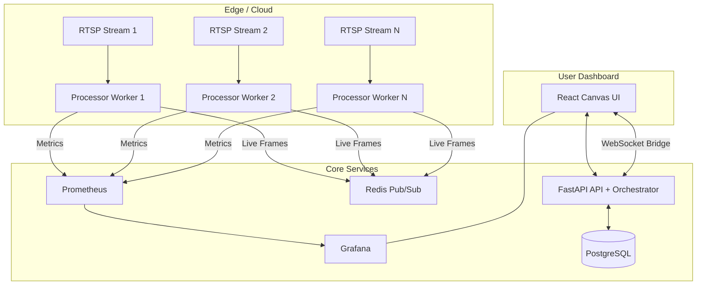

# Vector Flow Multi-Stream Platform

End-to-end implementation of a multi-stream optical-flow platform:

- **Per-stream worker containers** process RTSP/video feeds with **Lucas-Kanade optical flow** (OpenCV + NumPy).
- **FastAPI backend** manages stream CRUD and orchestrates worker lifecycle through Docker.
- **Prometheus + Grafana** collect and visualize time-series metrics.
- **React frontend** manages the camera fleet, previews live frames on canvas, and embeds Grafana dashboards.
- **Redis Pub/Sub** distributes live frame payloads from workers to the dashboard in near real-time.

## Architecture



## Tech Stack

- **Worker**: Python, OpenCV, NumPy, Prometheus client, Redis client
- **API**: FastAPI, SQLAlchemy, Docker SDK for Python, PostgreSQL, Redis, Prometheus client
- **Frontend**: React + Vite + Canvas
- **Infra**: Docker Compose, PostgreSQL, Redis, Prometheus, Grafana, Nginx

## Repository Layout

```text
.
├── docker-compose.yml
├── init.sql
├── backend/
│   ├── Dockerfile
│   ├── requirements.txt
│   └── app/
├── worker/
│   ├── Dockerfile
│   ├── requirements.txt
│   └── processor.py
├── prometheus/
│   ├── prometheus.yml
│   └── file_sd/workers.json
├── grafana/
│   ├── dashboards/vector-flow.json
│   └── provisioning/
├── frontend/
│   ├── Dockerfile
│   ├── nginx.conf
│   └── src/
└── README.md
```

## Quick Start

## 1. Prerequisites

- Docker + Docker Compose
- Enough CPU/GPU for video processing
- Network access from workers to RTSP/video source URLs

## 2. Launch

```bash
docker compose up --build
```

This starts:

- `frontend` on [http://localhost:5173](http://localhost:5173)
- `api` on [http://localhost:8000](http://localhost:8000)
- `prometheus` on [http://localhost:9090](http://localhost:9090)
- `grafana` on [http://localhost:3000](http://localhost:3000) (admin/admin)
- `postgres` on `localhost:5432`
- `redis` on `localhost:6379`

## 3. Add a stream

Use the frontend form or call API directly:

```bash
curl -X POST http://localhost:8000/streams \
  -H "Content-Type: application/json" \
  -d '{
    "name": "Demo Feed",
    "rtsp_url": "http://commondatastorage.googleapis.com/gtv-videos-bucket/sample/ForBiggerBlazes.mp4",
    "grid_size": 16,
    "threshold": 1.2,
    "is_active": true
  }'
```

When activated, the API spins up a dedicated worker container and updates Prometheus file-based service discovery.

## Runtime Behavior

- **Stream create/update/delete** stored in PostgreSQL.
- **Activate** starts a dedicated worker container (one per stream).
- **Deactivate** stops and removes that worker container.
- Each worker:
  - Captures frames from the configured URL.
  - Computes Lucas-Kanade optical flow vectors.
  - Publishes live annotated frame payloads to Redis.
  - Exposes `/metrics` for Prometheus scraping.
- API bridges Redis frames to the frontend over WebSocket (`/ws/frames`).

## API Endpoints

- `GET /health` - health probe
- `GET /streams` - list streams
- `POST /streams` - create stream
- `GET /streams/{id}` - fetch stream
- `PUT /streams/{id}` - update stream settings
- `DELETE /streams/{id}` - delete stream
- `POST /streams/{id}/activate` - start worker for stream
- `POST /streams/{id}/deactivate` - stop worker for stream
- `GET /metrics` - API-level Prometheus metrics
- `WS /ws/frames?stream_id=<uuid>` - live frame feed (filtered per stream)

OpenAPI docs:

- [http://localhost:8000/docs](http://localhost:8000/docs)

## Data Model

`camera_streams` table (created by `init.sql`):

- `id` UUID primary key
- `name` stream display name
- `rtsp_url` source URL
- `grid_size` sampling grid size
- `threshold` flow magnitude threshold
- `is_active` desired active state
- `worker_container_name` active worker container name
- `worker_started_at` worker start timestamp
- `created_at` record creation timestamp

## Prometheus Metrics

Workers expose these gauges/counters:

- `vector_flow_magnitude_avg`
- `vector_flow_magnitude_max`
- `vector_flow_vector_count`
- `vector_flow_fps`
- `vector_flow_frames_processed_total`

API exposes:

- `vector_flow_managed_streams_total`
- `vector_flow_active_streams_total`

## Grafana

Grafana is auto-provisioned with:

- Prometheus datasource (`uid: prometheus`)
- Dashboard: **Vector Flow Overview** (`uid: vector-flow`)

The frontend embeds this dashboard and passes the selected stream via `var-stream_id`.

## Frontend Local Development (without container)

```bash
npm --prefix frontend install
npm --prefix frontend run dev
```

Optional environment variables:

- `VITE_API_URL` (default `http://localhost:8000`)
- `VITE_GRAFANA_DASHBOARD_URL` (default `http://localhost:3000/d/vector-flow/vector-flow-overview`)

## Operational Notes

- The API requires Docker socket access to orchestrate workers (`/var/run/docker.sock`).
- Worker image is `vectorflow-worker:latest`; API can build it from `/opt/worker` if missing.
- Prometheus worker targets are generated in `prometheus/file_sd/workers.json`.

## Troubleshooting

- **Worker not starting**:
  - Check API logs: `docker compose logs -f api`
  - Confirm Docker socket mount exists in compose.
- **No live preview**:
  - Check worker logs: `docker ps | grep vector-worker-` then `docker logs <container>`
  - Verify Redis is healthy.
- **No metrics in Grafana**:
  - Confirm worker target exists in `prometheus/file_sd/workers.json`
  - Check Prometheus targets page: [http://localhost:9090/targets](http://localhost:9090/targets)

## Stop Everything

```bash
docker compose down -v
```
