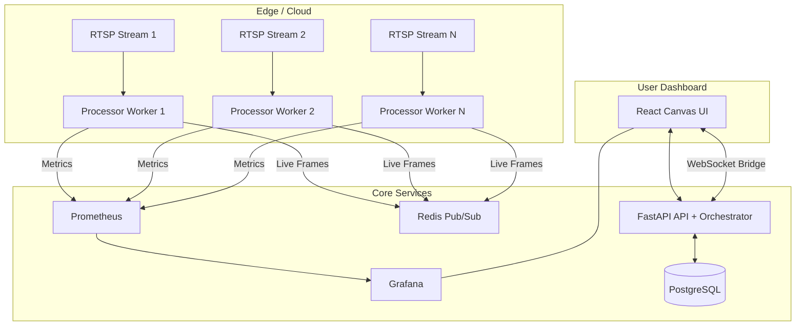

# Vector Flow Multi-Stream Platform

End-to-end implementation of a multi-stream optical-flow platform:

- **Per-stream worker containers** process RTSP/video feeds with **Lucas-Kanade optical flow** (OpenCV + NumPy).
- **FastAPI backend** manages stream CRUD and orchestrates worker lifecycle through Docker or Kubernetes.
- **Prometheus + Grafana** collect and visualize time-series metrics.
- **React frontend** manages the camera fleet, supports map-based stream geolocation, previews live frames on canvas, and embeds Grafana dashboards.
- **Redis Pub/Sub** distributes live frame payloads from workers to the dashboard in near real-time.
- **Stream health validation** surfaces connection failures in the UI with per-stream error messages.

## Architecture



## Tech Stack

- **Worker**: Python, OpenCV, NumPy, Prometheus client, Redis client
- **API**: FastAPI, SQLAlchemy, Docker SDK for Python, Kubernetes Python client, PostgreSQL, Redis, Prometheus client
- **Frontend**: React + Vite + Canvas + Leaflet (map picker)
- **Infra**: Docker Compose and Kubernetes, PostgreSQL, Redis, Prometheus, Grafana, Nginx

## Repository Layout

```text
.
├── docker-compose.yml
├── init.sql
├── backend/
│   ├── Dockerfile
│   ├── requirements.txt
│   └── app/
├── worker/
│   ├── Dockerfile
│   ├── requirements.txt
│   └── processor.py
├── prometheus/
│   ├── prometheus.yml
│   └── file_sd/workers.json
├── grafana/
│   ├── dashboards/vector-flow.json
│   └── provisioning/
│       ├── alerting/alert_rules.yml
│       ├── alerting/contact_points.yml
│       ├── alerting/notification_policies.yml
│       ├── dashboards/dashboard.yml
│       └── datasources/datasource.yml
├── frontend/
│   ├── Dockerfile
│   ├── nginx.conf
│   └── src/
├── k8s/
│   ├── deploy-local.sh
│   ├── delete-local.sh
│   └── *.yaml
└── README.md
```

## Quick Start

### Option A: Docker Compose

- Docker + Docker Compose
- Enough CPU/GPU for video processing
- Network access from workers to RTSP/video source URLs

Launch:

```bash
docker compose up --build
```

This starts:

- `frontend` on [http://localhost:5173](http://localhost:5173)
- `api` on [http://localhost:8000](http://localhost:8000)
- `prometheus` on [http://localhost:9090](http://localhost:9090)
- `grafana` on [http://localhost:3000](http://localhost:3000) (admin/admin)
- `postgres` on `localhost:5432`
- `redis` on `localhost:6379`

### Option B: Kubernetes (local cluster)

Prerequisites:

- `kubectl` configured to your running local cluster
- Docker (to build local images)
- Enough CPU/GPU for video processing
- Network access from workers to RTSP/video source URLs

Deploy:

```bash
./k8s/deploy-local.sh
```

Optional overrides (no YAML edits required):

- `API_IMAGE` (default `vectorflow-api:local`)
- `WORKER_IMAGE` (default `vectorflow-worker:local`)
- `FRONTEND_IMAGE` (default `vectorflow-frontend:local`)
- `VITE_API_URL` (default `http://localhost:8000`)
- `VITE_GRAFANA_DASHBOARD_URL` (default `http://localhost:3000/d/vector-flow/vector-flow-overview`)

Note: current manifests are pinned to namespace `vectorflow`.

Expose services locally (run each in a separate terminal):

```bash
kubectl -n vectorflow port-forward svc/frontend 5173:80
kubectl -n vectorflow port-forward svc/api 8000:8000
kubectl -n vectorflow port-forward svc/grafana 3000:3000
kubectl -n vectorflow port-forward svc/prometheus 9090:9090
```

## Add a Stream

Use the frontend form or call API directly:

```bash
curl -X POST http://localhost:8000/streams \
  -H "Content-Type: application/json" \
  -d '{
    "name": "Demo Feed",
    "rtsp_url": "http://commondatastorage.googleapis.com/gtv-videos-bucket/sample/ForBiggerBlazes.mp4",
    "location_name": "San Francisco Civic Center",
    "latitude": 37.7749,
    "longitude": -122.4194,
    "orientation_deg": 45.0,
    "view_angle_deg": 60.0,
    "view_distance_m": 120.0,
    "camera_tilt_deg": 15.0,
    "camera_height_m": 4.0,
    "grid_size": 16,
    "win_radius": 8,
    "threshold": 1.2,
    "arrow_scale": 4.0,
    "arrow_opacity": 90.0,
    "gradient_intensity": 1.0,
    "show_feed": true,
    "show_arrows": true,
    "show_magnitude": false,
    "show_trails": false,
    "is_active": true
  }'
```

When activated, the API spins up a dedicated worker runtime per stream:

- Docker Compose mode: worker container via Docker API.
- Kubernetes mode: worker `Deployment` via Kubernetes API.

## Tune from live preview

1. Create stream with URL.
2. Select stream in the fleet list and view live preview.
3. Click **Tune Selected Stream**.
4. Set stream location by searching address/place, clicking map, or using current location.
5. Choose one of the suggested labels (point + nearby) or edit `Location Name`.
6. Set camera heading + cone (`orientation_deg`, `view_angle_deg`, `view_distance_m`) and mount profile (`camera_tilt_deg`, `camera_height_m`) to represent direction/FOV on map.
7. Adjust controls (`show_feed`, `show_arrows`, `show_magnitude`, `show_trails`, `grid_size`, `win_radius`, `threshold`, `arrow_scale`, `arrow_opacity`, `gradient_intensity`).
8. Save config.

If the stream is active, saving config restarts its worker with the new settings so processing + Grafana metrics use the updated values.

## Runtime Behavior

- **Stream create/update/delete** stored in PostgreSQL.
- **Activate** starts a dedicated worker runtime (one per stream).
- **Deactivate** stops and removes that worker runtime.
- **Save config on an active stream** restarts its worker with new tuning values.
- Each worker:
  - Captures frames from the configured URL.
  - Computes Lucas-Kanade optical flow vectors using stream config (`grid_size`, `win_radius`, `threshold`).
  - Renders live frame overlays using stream display config (`show_*`, `arrow_scale`, `arrow_opacity`, `gradient_intensity`).
  - Publishes live frame + vectors payloads and explicit stream connection status/error events to Redis.
  - Exposes `/metrics` for Prometheus scraping.
- API bridges Redis frames to the frontend over WebSocket (`/ws/frames`).

## API Endpoints

- `GET /health` - health probe
- `GET /streams` - list streams
- `POST /streams` - create stream
- `GET /streams/{id}` - fetch stream
- `PUT /streams/{id}` - update stream settings
- `DELETE /streams/{id}` - delete stream
- `POST /streams/{id}/activate` - start worker for stream
- `POST /streams/{id}/deactivate` - stop worker for stream
- `GET /streams/{id}/worker-logs?tail=160` - latest worker activity log lines
- `GET /settings/system` - global live preview system settings
- `PUT /settings/system` - update global live preview throttling settings
- `POST /alerts/webhook` - Grafana webhook receiver for alert notifications
- `GET /alerts?limit=500` - list recently received webhook alerts
- `GET /metrics` - API-level Prometheus metrics
- `WS /ws/frames?stream_id=<uuid>` - live frame feed (filtered per stream)
- `WS /ws/frames` - live frame feed for all streams

OpenAPI docs:

- [http://localhost:8000/docs](http://localhost:8000/docs)

## Data Model

`camera_streams` table (created by `init.sql`):

- `id` UUID primary key
- `name` stream display name
- `rtsp_url` source URL
- `location_name` optional saved label for the map point/address
- `latitude`, `longitude` optional stream location coordinates
- `orientation_deg` camera orientation in degrees (0-359.9)
- `view_angle_deg` camera field-of-view cone angle (5-170)
- `view_distance_m` camera cone distance on map in meters
- `camera_tilt_deg` camera tilt in degrees (`+` = down, `-` = up; range `-45` to `89`)
- `camera_height_m` camera installation height in meters (`0.5` to `120`)
- `grid_size` sampling grid size
- `win_radius` LK window radius
- `threshold` flow magnitude threshold
- `arrow_scale` rendered arrow length multiplier
- `arrow_opacity` rendered arrow alpha (0-100)
- `gradient_intensity` magnitude heat intensity
- `show_feed`, `show_arrows`, `show_magnitude`, `show_trails` live overlay toggles
- `is_active` desired active state
- `worker_container_name` active worker container name
- `worker_started_at` worker start timestamp
- `created_at` record creation timestamp

`system_settings` table:

- `id` singleton row id (`1`)
- `live_preview_fps` global worker frame publish cap
- `live_preview_jpeg_quality` global preview compression quality
- `live_preview_max_width` global preview resize cap (0 disables resize)
- `orientation_offset_deg` global direction-to-map calibration offset
- `updated_at` last settings update timestamp

`alert_webhook_events` table:

- `id` auto-increment primary key
- `receiver` Grafana receiver/contact-point name
- `group_key` Grafana notification group key
- `notification_status` webhook-level status (`firing`/`resolved`)
- `alert_status` per-alert status
- `alert_name`, `alert_uid`, `severity`, `stream_name`, `fingerprint`
- `summary`, `description`
- `starts_at`, `ends_at`
- `labels`, `annotations`, `values`, `raw_payload` (JSONB)
- `received_at` webhook ingest timestamp

## Prometheus Metrics

Workers expose these gauges/counters:

- `vector_flow_magnitude_avg`
- `vector_flow_magnitude_max`
- `vector_flow_vector_count`
- `vector_flow_fps`
- `vector_flow_frames_processed_total`
- `vector_flow_stream_connected`
- `vector_flow_direction_degrees`
- `vector_flow_direction_coherence`
- `vector_flow_stream_location`
- `vector_flow_magnitude_geo`
- `vector_flow_vector_count_geo`
- `vector_flow_worker_memory_rss_bytes`
- `vector_flow_worker_memory_percent`
- `vector_flow_gpu_available`
- `vector_flow_gpu_utilization_percent`
- `vector_flow_gpu_memory_used_bytes`
- `vector_flow_gpu_memory_total_bytes`

API exposes:

- `vector_flow_managed_streams_total`
- `vector_flow_active_streams_total`
- `vector_flow_running_streams_total`
- `vector_flow_streams_by_state{state="running|deactivated|error"}`

## Grafana

Grafana is auto-provisioned with:

- Prometheus datasource (`uid: prometheus`)
- Dashboard: **Vector Flow Overview** (`uid: vector-flow`)
- Alert rule group: **vector-flow-alerts** (provisioned from `grafana/provisioning/alerting/alert_rules.yml`)
- Contact point: **vectorflow-alert-webhook** (webhook to `http://api:8000/alerts/webhook`)
- Notification policy route to send all alerts to that contact point

The frontend embeds this dashboard and passes the selected stream via `var-stream_name`.
Dashboard panels include optical-flow metrics, per-stream vector direction/coherence, worker memory/GPU observability, a running-stream count stat, a fleet state pie chart (`running`, `deactivated`, `error`), and a Geomap panel with stream points + current-magnitude heatmap layers.

Frontend routes:

- `/` Stream configuration + live preview.
- `/live` Live overview grid with latest frame from every stream.
- `/dashboard` Embedded Grafana overview.
- `/alerts` Table of webhook alerts saved by the API.
- `/settings` Global system settings (live preview throttling).
- `?stream=<stream_id>` URL state for selected stream (used across app routes).
- `?range=<5m|15m|30m|1h|3h|6h|12h|24h|7d>` dashboard time window for embedded Grafana.

### Live Frame Throttling

Use `/settings` to control global live preview throughput:

- `live_preview_fps`: publish cap per worker stream (default `6.0` FPS)
- `live_preview_jpeg_quality`: JPEG quality for frame payloads (default `65`)
- `live_preview_max_width`: resize cap before publish (`0` disables resizing, default `960`)
- `orientation_offset_deg`: global offset applied to live map direction arrows (default `0`)

Saving throughput settings can restart active workers so new limits apply immediately.
The API frame broker also applies the same FPS cap when fan-out broadcasting to WebSocket clients.

### Grafana Alerts

Provisioned alert rules:

- `Stream Error State Detected` (`vector_flow_streams_by_state{state="error"} > 0`)
- `Running Streams Below Active Streams` (`vector_flow_active_streams_total > vector_flow_running_streams_total`)
- `Low Processing FPS` (per stream, `avg_over_time(vector_flow_fps[2m]) < 5`)
- `Worker Memory High` (per stream, `vector_flow_worker_memory_percent > 90`)

All rules are provisioned as active (`isPaused: false`) and are routed to the webhook contact point.
The API stores incoming notifications, and the frontend `/alerts` page displays them in a table.

If you change any alerting provisioning file, restart Grafana:

```bash
docker compose restart grafana
```

Kubernetes equivalent:

```bash
kubectl -n vectorflow create configmap vectorflow-grafana-provisioning \
  --from-file=datasource.yml=grafana/provisioning/datasources/datasource.yml \
  --from-file=dashboard.yml=grafana/provisioning/dashboards/dashboard.yml \
  --from-file=alert_rules.yml=grafana/provisioning/alerting/alert_rules.yml \
  --from-file=contact_points.yml=grafana/provisioning/alerting/contact_points.yml \
  --from-file=notification_policies.yml=grafana/provisioning/alerting/notification_policies.yml \
  --dry-run=client -o yaml | kubectl apply -f -
kubectl -n vectorflow rollout restart deployment/vectorflow-grafana
```

## Stream Validation and Errors

- Active streams are marked with connection state (`connected`, `starting`, `stream error`, `worker down`).
- When source connection fails, the worker emits a detailed error and the stream card is highlighted in red.
- Latest stream error is shown both in fleet cards and in the live preview panel.

## Frontend Local Development (without container)

```bash
npm --prefix frontend install
npm --prefix frontend run dev
```

Optional environment variables:

- `VITE_API_URL` (default `http://localhost:8000`)
- `VITE_GRAFANA_DASHBOARD_URL` (default `http://localhost:3000/d/vector-flow/vector-flow-overview`)

## Operational Notes

- Worker runtime is selected with `WORKER_RUNTIME`:
  - `docker` (default): API orchestrates worker containers via Docker socket.
  - `kubernetes`: API orchestrates worker deployments via Kubernetes API.
- Docker runtime notes:
  - API requires Docker socket access (`/var/run/docker.sock`).
  - Worker image defaults to `vectorflow-worker:latest`; API can build it from `/opt/worker` if missing.
  - Prometheus worker targets are generated in `prometheus/file_sd/workers.json`.
- Kubernetes runtime notes:
  - API service account needs RBAC to manage worker deployments and read worker pod logs.
  - Prometheus discovers worker pods using Kubernetes pod service discovery (no file SD volume sharing needed).

## Troubleshooting

- **Worker not starting**:
  - Check API logs: `docker compose logs -f api`
  - Confirm Docker socket mount exists in compose.
- **Worker not starting on Kubernetes**:
  - Check API logs: `kubectl -n vectorflow logs deploy/vectorflow-api`
  - Confirm API service account RBAC exists: `kubectl -n vectorflow get role,rolebinding | grep vectorflow-api-worker-manager`
  - Confirm worker image exists in your cluster runtime (`kind load`, `minikube image load`, or registry pull access).
- **No live preview**:
  - Check worker logs: `docker ps | grep vector-worker-` then `docker logs <container>`
  - Verify Redis is healthy.
- **No live preview on Kubernetes**:
  - Find worker pod: `kubectl -n vectorflow get pods -l app=vectorflow-worker`
  - Check worker logs: `kubectl -n vectorflow logs <worker-pod>`
  - Verify Redis is healthy: `kubectl -n vectorflow get pods -l app=vectorflow-redis`
- **No metrics in Grafana**:
  - Confirm worker target exists in `prometheus/file_sd/workers.json`
  - Check Prometheus targets page: [http://localhost:9090/targets](http://localhost:9090/targets)
- **No worker metrics in Grafana on Kubernetes**:
  - Check Prometheus targets page and ensure `vector_flow_workers` endpoints are `UP`.
  - Verify worker pods expose container port `9100`.
- **Worker warns `Error -2 connecting to redis:6379`**:
  - Ensure worker and Redis are on the same Docker network (`vectorflow`).
  - Restart API + workers after Redis is up: `docker compose restart api`.
  - Worker now auto-tries Redis host fallbacks (`redis`, `vectorflow-redis`) and throttles repeated warning spam.
- **Frame broker reconnects with Redis `output buffer limits`**:
  - Reduce frame throughput in `/settings` by lowering preview FPS and JPEG quality and/or setting a smaller max width.
  - Save with worker restart enabled so active workers pick up new throttling values.

## Stop Everything

Docker Compose:

```bash
docker compose down -v
```

Kubernetes:

```bash
./k8s/delete-local.sh
```
